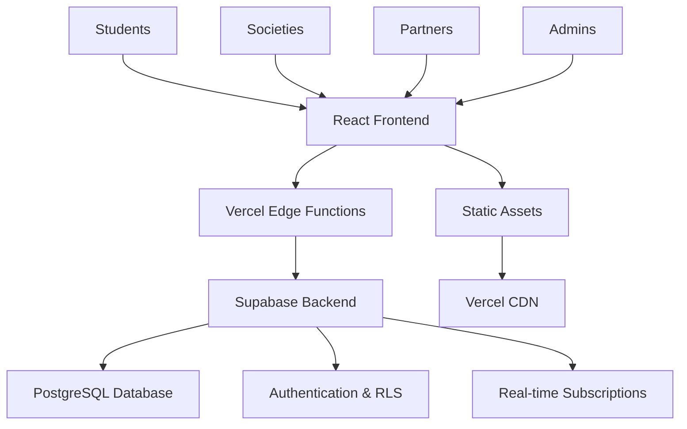

# DUPulse - Durham University Event Hub

**The comprehensive platform connecting Durham University students with every event, society meetup, and opportunity on campus.**

[](https://github.com/AdamsCode1/PulsePlatform)
[](https://www.typescriptlang.org/)
[](https://reactjs.org/)
[](https://supabase.com/)
[](#licensing--credits)
[](https://vercel.com)
[](https://tailwindcss.com/)

## Architecture Overview



**Why DUPulse?**
- **No more FOMO**: Never miss important events across Durham's 200+ societies
- **One unified platform**: Replace scattered WhatsApp groups, emails, and websites

<details>
<summary>📋 Table of Contents</summary>

- [Quickstart](#quickstart)
- [Features](#features)
- [Architecture Overview](#architecture-overview-1)
- [Configuration](#configuration)
- [Development Setup](#development-setup)
- [Testing & Quality](#testing--quality)
- [Deployment](#deployment)
- [Security](#security)
- [Roadmap](#roadmap)
- [Contributing](#contributing)
- [FAQ / Troubleshooting](#faq--troubleshooting)
- [Examples / Showcase](#examples--showcase)
- [Licensing & Credits](#licensing--credits)

</details>

## Quickstart

### Prerequisites
- **Node.js** 18.0.0+ 
- **Bun** (recommended) or npm/yarn
- **Git** for version control

### Installation & Setup

```bash
# Clone the repository
git clone https://github.com/AdamsCode1/PulsePlatform.git
cd PulsePlatform

# Install dependencies (Bun recommended for speed)
bun install
# or: npm install

# Set up environment variables
cp .env.test .env.local
# Edit .env.local with your Supabase credentials

# Start development server
bun run dev
# or: npm run dev
```

**Success indicator**: Navigate to `http://localhost:5173` and see the DUPulse landing page with purple gradient background.

### Environment Setup
```bash
# Required Supabase configuration
VITE_SUPABASE_URL=https://your-project.supabase.co
VITE_SUPABASE_ANON_KEY=your-anon-key
VITE_APP_URL=http://localhost:5173

# Backend API configuration  
SUPABASE_URL=https://your-project.supabase.co
SUPABASE_SERVICE_ROLE_KEY=your-service-role-key
```

## Features

### 🔐 Multi-Role Authentication
- **Students**: Event discovery, RSVP management, deal access
- **Societies**: Event submission, member engagement analytics
- **Partners**: Business event promotion, student deal offerings
- **Administrators**: Platform oversight, content moderation

### 📊 Role-Specific Dashboards
- **Student Dashboard**: Personalised event recommendations, RSVP tracking
- **Society Dashboard**: Event submission workflow, attendance analytics
- **Partner Dashboard**: Event and deal management, engagement metrics
- **Admin Dashboard**: User management, content approval, platform analytics

### 🎨 Modern Design System
- **Dark theme**: Purple/black gradients with animated PULSE pattern backgrounds
- **Mobile-first**: Responsive design optimised for all devices
- **Accessibility**: WCAG 2.1 AA compliant, high contrast support
- **Component library**: Built on shadcn/ui and Radix UI primitives

### 🎯 Event Management
- **Smart discovery**: Filter by society, date, category, and location
- **One-click RSVP**: Seamless event registration for students
- **Approval workflow**: Society event submission with admin moderation
- **Real-time updates**: Live RSVP counts and event status changes

## Architecture Overview

### Core Technologies
- **Frontend**: React 18 with TypeScript, Vite build system
- **Backend**: Supabase (PostgreSQL + real-time subscriptions)
- **Authentication**: Supabase Auth with JWT tokens
- **Deployment**: Vercel serverless platform with edge functions
- **Styling**: Tailwind CSS with shadcn/ui component library

### Data Flow
- **Authentication**: JWT-based with role-specific routing
- **Real-time**: WebSocket connections for live RSVP updates
- **Security**: Row Level Security (RLS) policies in PostgreSQL
- **Performance**: Edge caching and CDN delivery via Vercel

### Key Dependencies
- **UI Framework**: React 18.3.1, React Router v6
- **Type Safety**: TypeScript 5.5.3, Zod validation
- **Forms**: React Hook Form with Zod resolvers
- **Animation**: Framer Motion, GSAP for smooth interactions
- **Testing**: Jest with React Testing Library

## Configuration

### Environment Variables

| Variable | Required | Default | Description |
|----------|----------|---------|-------------|
| `VITE_SUPABASE_URL` | ✅ | - | Supabase project URL |
| `VITE_SUPABASE_ANON_KEY` | ✅ | - | Supabase anonymous key |
| `VITE_APP_URL` | ✅ | `http://localhost:5173` | Application base URL |
| `SUPABASE_SERVICE_ROLE_KEY` | ✅ | - | Backend service role key |
| `VITE_API_BASE_URL` | ❌ | `/api` | API endpoint base path |

### Configuration Files
- **Supabase**: `./supabase/config.toml` - Database and API configuration
- **Tailwind**: `./tailwind.config.ts` - Design system and theming
- **TypeScript**: `./tsconfig.json` - Compiler options and paths
- **Vite**: `./vite.config.ts` - Build configuration and plugins

## Development Setup

### Repository Structure
```
PulsePlatform/
├── api/                    # Vercel serverless functions
├── docs/                   # Comprehensive documentation
├── src/                    # React frontend source
│   ├── components/         # Reusable UI components
│   ├── pages/             # Route components
│   ├── hooks/             # Custom React hooks
│   └── lib/               # Utility functions
├── supabase/              # Database migrations & config
├── tests/                 # Jest test suites
└── tools/                 # Development utilities
```

### Development Workflow

```bash
# Development server with hot reload
bun run dev

# Production build
bun run build

# Preview production build
bun run preview

# Type checking
tsc --noEmit

# Lint code
bun run lint

# Format code (auto-fix)
bunx prettier --write .
```

### Common Development Tasks

```bash
# Database operations
supabase start              # Start local Supabase
supabase db reset          # Reset local database
supabase db push           # Apply migrations

# Testing commands
bun test                   # Run unit tests
bun test --coverage        # Generate coverage report
bun test --watch          # Watch mode for development
```

## Testing & Quality

### Running Tests
```bash
# Unit tests with Jest
bun test

# Coverage reporting
bun test --coverage

# Integration tests
bun test tests/api.test.ts

# End-to-end testing (Playwright)
npx playwright test
```

### Code Quality Tools
```bash
# ESLint for code linting
bun run lint

# TypeScript type checking
tsc --noEmit

# Prettier for code formatting
bunx prettier --check .
```

### Quality Metrics
- **Test Coverage**: 80%+ on core business logic
- **Type Safety**: Strict TypeScript configuration
- **Performance**: Lighthouse score >90 on all pages
- **Accessibility**: WCAG 2.1 AA compliance testing

## Deployment

### Vercel (Production)
```bash
# Install Vercel CLI
npm install -g vercel

# Deploy to production
vercel --prod

# Environment variables (set via Vercel dashboard)
VITE_SUPABASE_URL=your-production-url
VITE_SUPABASE_ANON_KEY=your-production-key
SUPABASE_SERVICE_ROLE_KEY=your-service-key
```

### Docker (Alternative)
```dockerfile
FROM node:18-alpine
WORKDIR /app
COPY package*.json ./
RUN npm ci --only=production
COPY . .
RUN npm run build
EXPOSE 3000
CMD ["npm", "run", "preview", "--", "--port", "3000", "--host"]
```

### Database Migrations
```bash
# Apply database schema changes
supabase db push

# Create new migration
supabase db diff --schema public > supabase/migrations/new_migration.sql

# Reset database (development only)
supabase db reset
```

## Security

### Authentication & Authorisation
- **JWT tokens**: Secure authentication via Supabase Auth
- **Row Level Security**: Database-level access control policies
- **Role-based access**: Granular permissions per user type
- **Session management**: Automatic token refresh and validation

### Data Protection
- **Input validation**: Zod schemas for all form inputs and API endpoints
- **SQL injection prevention**: Parameterised queries via Supabase client
- **XSS protection**: Content Security Policy headers
- **HTTPS enforcement**: TLS encryption for all communications

### Vulnerability Reporting
Report security issues privately via [GitHub Security Advisories](https://github.com/AdamsCode1/PulsePlatform/security/advisories/new) or email the maintainers directly.

## Roadmap

### Q1 2025
- [ ] **Student Deals Platform** - Exclusive discounts and offers integration
- [ ] **Mobile Push Notifications** - Real-time event reminders and updates
- [ ] **AI Event Recommendations** - Personalised suggestions based on attendance history

### Q2 2025
- [ ] **Social Features** - User profiles, friend connections, shared interests
- [ ] **Achievement System** - Badges and rewards for event participation
- [ ] **Advanced Analytics** - Society engagement metrics and insights dashboard

### Future Enhancements
- [ ] **Mobile App** - Native iOS/Android applications
- [ ] **Calendar Integration** - Sync with Google Calendar, Outlook
- [ ] **Advanced Search** - Full-text search with filters and sorting

View detailed roadmap and vote on features in [GitHub Issues](https://github.com/AdamsCode1/PulsePlatform/issues).

## Contributing

We welcome contributions from the Durham University community! 

### Quick Start for Contributors
1. **Fork** the repository on GitHub
2. **Clone** your fork: `git clone https://github.com/YOUR_USERNAME/PulsePlatform.git`
3. **Create** a feature branch: `git checkout -b feature/amazing-feature`
4. **Make** your changes and add tests
5. **Submit** a Pull Request with clear description

### Development Guidelines
- **Code Style**: Follow ESLint and Prettier configurations
- **Testing**: Write tests for new features and bug fixes
- **Documentation**: Update relevant docs for user-facing changes
- **Commits**: Use conventional commit format (`feat:`, `fix:`, `docs:`)

### Good First Issues
Find beginner-friendly tasks labelled [`good first issue`](https://github.com/AdamsCode1/PulsePlatform/labels/good%20first%20issue).

## FAQ / Troubleshooting

### Common Issues

**Q: Development server won't start**
```bash
# Clear node_modules and reinstall
rm -rf node_modules bun.lockb
bun install
bun run dev
```

**Q: Database connection errors**
- Verify `VITE_SUPABASE_URL` and `VITE_SUPABASE_ANON_KEY` in `.env.local`
- Check Supabase project status at [app.supabase.com](https://app.supabase.com)

**Q: Build fails with TypeScript errors**
```bash
# Run type checking to see specific errors
tsc --noEmit
# Fix type errors, then rebuild
bun run build
```

**Q: CORS errors in development**
- Ensure `VITE_APP_URL` matches your dev server URL
- Check Supabase project settings for allowed origins

**Q: Authentication not working**
- Verify environment variables are correctly set
- Check browser network tab for 401/403 errors
- Ensure user exists and has correct role in database

### Performance Tips
- **Code splitting**: Use React.lazy() for large route components
- **Image optimisation**: Compress images and use modern formats (WebP)
- **Bundle analysis**: Run `bunx vite-bundle-analyzer` to check bundle size

## Examples / Showcase

### Live Demo
Visit the live platform: [dupulse-platform.vercel.app](https://dupulse-platform.vercel.app)

### API Usage Examples
```typescript
// Event creation (Society role)
const newEvent = await fetch('/api/unified', {
  method: 'POST',
  headers: { 
    'Content-Type': 'application/json',
    'Authorization': `Bearer ${token}`
  },
  body: JSON.stringify({
    action: 'create',
    type: 'events',
    data: {
      title: 'Tech Society Meetup',
      description: 'Monthly networking event',
      date: '2025-02-15',
      capacity: 50
    }
  })
});

// RSVP to event (Student role)
const rsvp = await fetch('/api/unified', {
  method: 'POST', 
  headers: {
    'Content-Type': 'application/json',
    'Authorization': `Bearer ${token}`
  },
  body: JSON.stringify({
    action: 'create',
    type: 'rsvps', 
    data: { event_id: eventId }
  })
});
```

### Component Usage
```tsx
// Event card component
import { EventCard } from '@/components/EventCard';

<EventCard
  event={{
    id: '123',
    title: 'Durham Tech Meetup',
    date: '2025-02-15',
    society: 'Tech Society',
    capacity: 50,
    current_rsvps: 23
  }}
  onRSVP={(eventId) => handleRSVP(eventId)}
/>
```

## Licensing & Credits

### License
This project is licensed under the MIT License - see the [LICENSE](LICENSE) file for details.

**SPDX-License-Identifier: MIT**

### Acknowledgements
- **Durham University** for inspiration and the vibrant student community
- **Supabase** for excellent backend-as-a-service platform
- **Vercel** for seamless deployment and hosting
- **shadcn/ui** for beautiful, accessible UI components
- **React** and **TypeScript** communities for robust development tools

### Third-Party Dependencies
This project uses various open-source libraries. Full attribution available in `package.json` and generated license reports.

### Contributing Universities and Organisations
- Durham University Student Union
- Durham University Societies
- Local Durham business partners

---

**Built with ❤️ for the Durham University community**

*Never miss another event at Durham. Join thousands of students already using DUPulse to discover, attend, and connect.*
